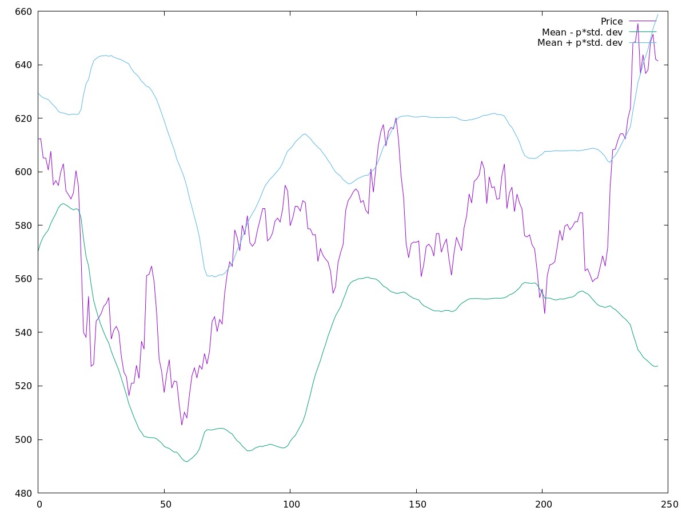
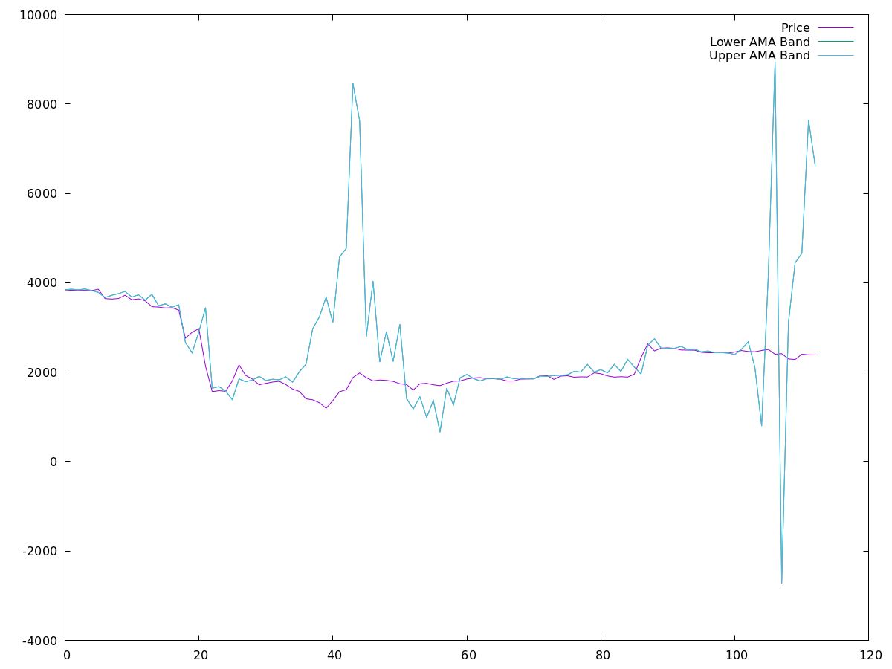
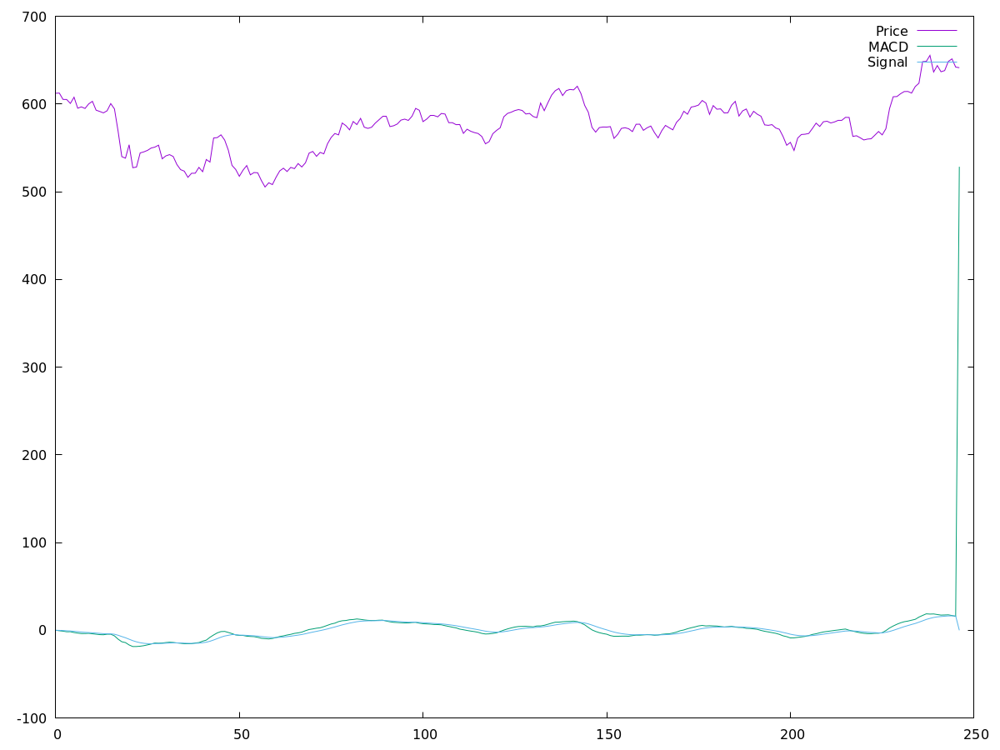
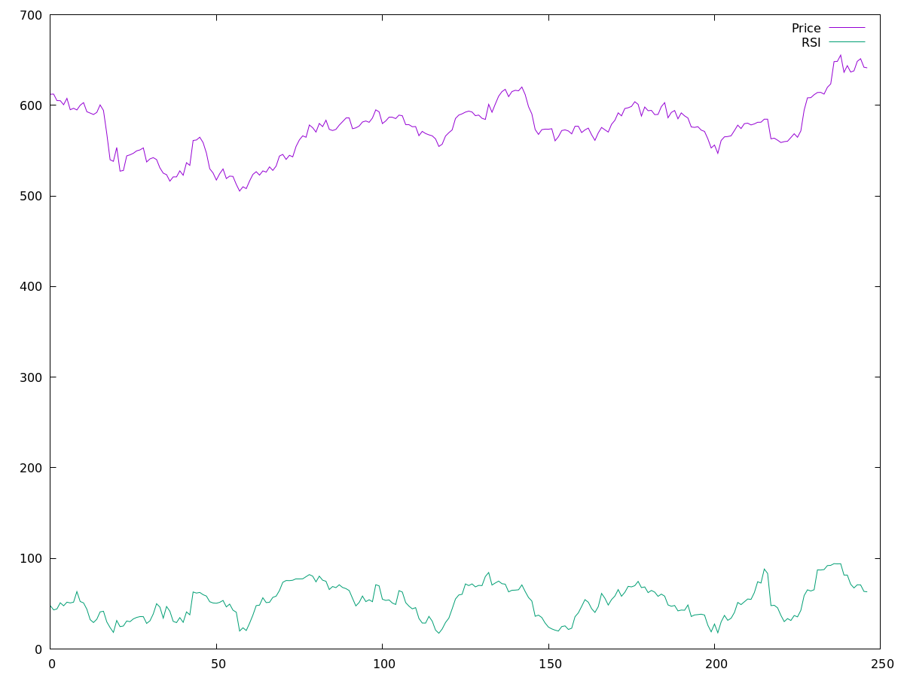
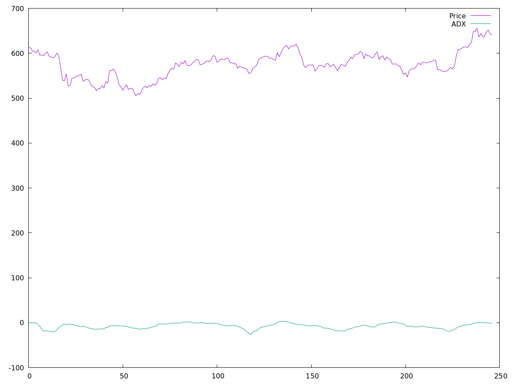
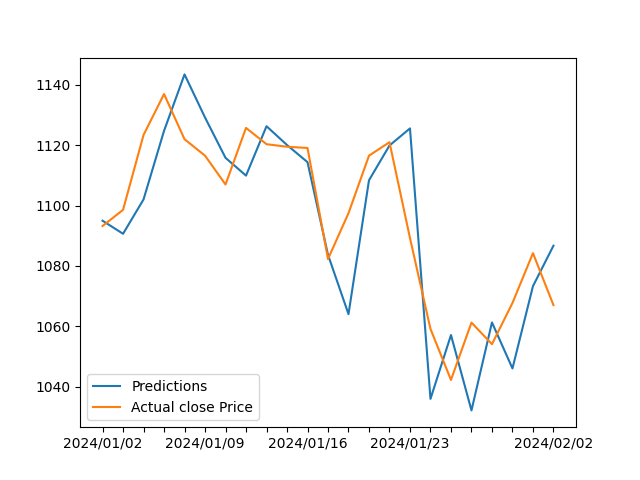
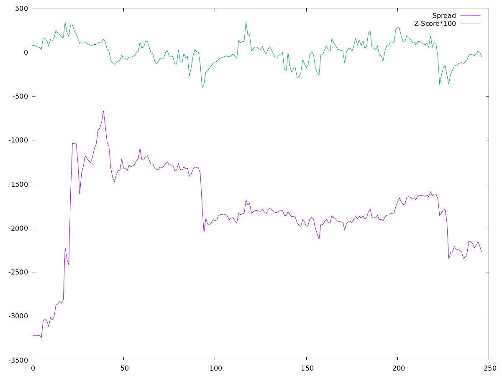

# COP290 Assignment 1.3: Trading Strategies

## Overall Structure

The `Strategy` base class provides the basic methods to fetch stock data and write to various streams and files. All the other strategies discused are implemented as derived classes of `Strategy`. The `runStrategy` method is a virtual function of the base class and is
implemented in all the derived classes according to the strategies. This helps have the same interface for all the strategies while also keeping their code serparate and modular.

### Strategy::fetchStockData

This method runs a python script to fetch the data using the jugaad-data library and store it in a .csv file.

## Strategies

The following strategies have been implemented. Usage instructions are provided in `StrategyMain.cpp`and below are the following plots to show all of the trends observed for each strategy.

### Basic

### n-Day Moving Average (DMA)
Here, we have plotted the stock price with the n-day moving mean and standard deviation difference bands. The upper band represents the value = mean + p\*standard deviation, whereas the lower band represents the value = mean - p\*standard deviation.

Here, we have plotted the stock price with the adaptive moving average indicator. 
### Adaptive Moving Average (DMA++)

## Indicators
Here, we have used various indicators to implement strategies. Below, we have shown for each indicator it's trend with the stock price.

### MACD

### Relative Strength Index (RSI)

### ADX

### Linear Regression 

The normal equation for the linear regression parameters is $$\beta = (X^T \cdot X)^{-1} \cdot X^T \cdot y$$ where $X$ is the input feature matrix and $y$ is the target feature.
To solve the above equation, we implement a `Matrix` class which has member functions to get the transpose, inverse and multiply two matrices. Once the parameters are identified, the predictions are computed as
$$y_{\text{pred}} = \beta^T \cdot x$$

The following plot shows both the predictions and the actual close prices for AXISBANK. We can see that the predictions are pretty bad and hence the strategy also generally performs badly.

### Best Of All

The best of all strategy is implemented by creating a `std::vector<Strategy *>` and calling the `runStrategy` method on each of them. This is where polymorphism plays a role. The run methods are called parallely by using omp parallel for directive. Moreover, the fetching
of data has also been parallelized to increase efficiency.

### Pairs Trading

In Pairs Trading Strategy, instead of betting on the price of a single stock, we instead bet on the spread between the price of a pair of stocks. Thus, even if both the prices are increasing or decreasing, we only care about the spread between the two.
When the z-score is high, we expect the spread to return to its mean, and hence, we short the spread (sell the spread). Similarly, when z-score is low, we long the spread.

### Stop-Loss in Pairs Trading
Often, we are stuck with unwanted positions in pairs trading strategy, and we want to clear them off to take newer positions and earn profits (Recall that we have a constraint on max position we can take). Thus, we include stop-loss based constraint in our strategy, We have already seen time based stop-loss in DMA. Here we will be looking at Loss based Stop-Loss Strategy.

In our implementation, first of all we have checked the z-score condition to see if we need to buy or sell a stock at that point of time. Now, we will check if that stock is clearing a current owned position, if it does then we will not push the current buy/sell in the queue, instead we will use this trade as a clearance. Now we will check both buy and sell queues, whichever is not empty to find all the stocks which can be cleared based on Loss based Stop-Loss Strategy.

Then we will calculate the overall position which we have created on that day and then we will update the order_statistics and daily_cashflow file accordingly updating our position and PnL.

